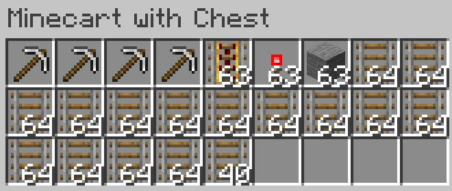

## Compatibility

Tested on Spigot-1.20.5, 1.21.

## Introduction

A Minecraft (Bukkit) plugin that allows to minecarts to auto-build their rails

## Features

If a chest minecart is moving and there is a solid block in the direction of movement.
1. Break two blocks in the direction of movement with the best pickaxe from the chest - or fail
2. Place the left-top regular rail from the chest in the direction of movement - or fail
3. If the minecart X or Z is NOT a multiple of 16 - finish
4. Break the right side block - or go to #7
5. If no solid block under right side, place the left-top solid block from the chest - or go to #7
6. Place the left-top redstone torch from the chest to the right side - or go to #7
7. If #4, or #5, or #6 didn't work for the right side, try for the left side - or fail
8. Place the left-top powered rail from the chest instead of the regular rail - or fail

A chest minecart needs the following inventory to build a 1000 block distance railway:

## Commands

`autominecart reload` - reload config from disk

## Permissions

* Access to 'reload' command:
`autominecart.reload` (default: op)

## Configuration
[Default configuration file](src/main/resources/config.yml)

## Author
I will be happy to add some features or fix bugs. My mail: uprial@gmail.com.

## Useful links
* [Project on GitHub](https://github.com/uprial/autominecart)
* [Project on Bukkit Dev](https://legacy.curseforge.com/minecraft/bukkit-plugins/auto-minecart)
* [Project on Spigot](https://www.spigotmc.org/resources/autominecart.128389/)

## Related projects
* CustomBazookas: [Bukkit Dev](https://legacy.curseforge.com/minecraft/bukkit-plugins/custombazookas/) [GitHub](https://github.com/uprial/custombazookas), [Spigot](https://www.spigotmc.org/resources/custombazookas.124997/)
* CustomCreatures: [Bukkit Dev](http://dev.bukkit.org/bukkit-plugins/customcreatures/), [GitHub](https://github.com/uprial/customcreatures), [Spigot](https://www.spigotmc.org/resources/customcreatures.68711/)
* CustomNukes: [Bukkit Dev](http://dev.bukkit.org/bukkit-plugins/customnukes/), [GitHub](https://github.com/uprial/customnukes), [Spigot](https://www.spigotmc.org/resources/customnukes.68710/)
* CustomRecipes: [Bukkit Dev](https://dev.bukkit.org/projects/custom-recipes), [GitHub](https://github.com/uprial/customrecipes/), [Spigot](https://www.spigotmc.org/resources/customrecipes.89435/)
* CustomVillage: [Bukkit Dev](http://dev.bukkit.org/bukkit-plugins/customvillage/), [GitHub](https://github.com/uprial/customvillage/), [Spigot](https://www.spigotmc.org/resources/customvillage.69170/)
* MasochisticSurvival: [Bukkit Dev](https://legacy.curseforge.com/minecraft/bukkit-plugins/masochisticsurvival/), [GitHub](https://github.com/uprial/masochisticsurvival/), [Spigot](https://www.spigotmc.org/resources/masochisticsurvival.124943/)
