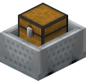
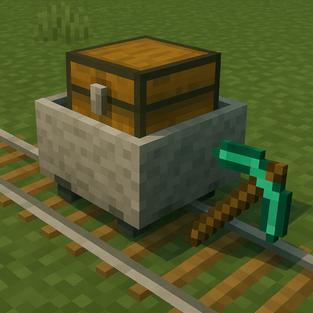

## Compatibility

Tested on Spigot-1.21.

## Introduction

A Minecraft (Bukkit) plugin that allows to minecarts to auto-build their rails

## Features

If a chest minecart is moving on straight rails and there is a full block under the direction of movement.
1. Look for a best pickaxe in the chest. 
2. Look for a left-top rails in the chest. 
3. If there is both the pickaxe and the rails, try to break two blocks with the pickaxe in the direction of movement - if can't, stop. 
4. Put the rails on the lower broken block. 
5. Check every 16th block: if there is a red torch and a powered rail inside the minecart, there is a full block under the right side - break the block, put the red torch instead of it, put the powered rail instead of the rails. 
6. Drop broken blocks on the floor.

## Commands

`autominecart reload` - reload config from disk

## Permissions

* Access to 'reload' command:
`autominecart.reload` (default: op)

## Configuration
[Default configuration file](src/main/resources/config.yml)

## Author
I will be happy to add some features or fix bugs. My mail: uprial@gmail.com.

## Useful links
* [Project on GitHub](https://github.com/uprial/autominecart)
* [Project on Bukkit Dev](TBD)
* [Project on Spigot](TBD)

## Related projects
* CustomBazookas: [Bukkit Dev](https://legacy.curseforge.com/minecraft/bukkit-plugins/custombazookas/) [GitHub](https://github.com/uprial/custombazookas), [Spigot](https://www.spigotmc.org/resources/custombazookas.124997/)
* CustomCreatures: [Bukkit Dev](http://dev.bukkit.org/bukkit-plugins/customcreatures/), [GitHub](https://github.com/uprial/customcreatures), [Spigot](https://www.spigotmc.org/resources/customcreatures.68711/)
* CustomNukes: [Bukkit Dev](http://dev.bukkit.org/bukkit-plugins/customnukes/), [GitHub](https://github.com/uprial/customnukes), [Spigot](https://www.spigotmc.org/resources/customnukes.68710/)
* CustomRecipes: [Bukkit Dev](https://dev.bukkit.org/projects/custom-recipes), [GitHub](https://github.com/uprial/customrecipes/), [Spigot](https://www.spigotmc.org/resources/customrecipes.89435/)
* CustomVillage: [Bukkit Dev](http://dev.bukkit.org/bukkit-plugins/customvillage/), [GitHub](https://github.com/uprial/customvillage/), [Spigot](https://www.spigotmc.org/resources/customvillage.69170/)
* MasochisticSurvival: [Bukkit Dev](https://legacy.curseforge.com/minecraft/bukkit-plugins/masochisticsurvival/), [GitHub](https://github.com/uprial/masochisticsurvival/), [Spigot](https://www.spigotmc.org/resources/masochisticsurvival.124943/)
